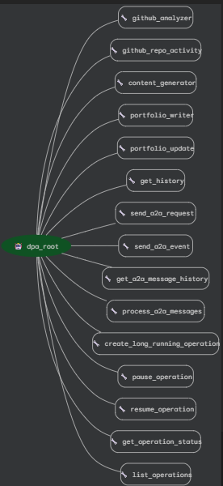

# Developer Portfolio Assistant Agent

**Subtitle:** Automatically generate and update your developer portfolio with AI-powered agentic workflows.

## 🚀 Overview

The Developer Portfolio Assistant Agent streamlines creation and upkeep of your developer portfolio by:
- Analyzing your GitHub profile and recent projects
- Summarizing your work with Google Gemini LLM
- Generating ready-to-post content (LinkedIn, blog, README, etc.)
- Logging all activity and saving updates with long-term memory for repeatable, auditable results

This agent demonstrates a multi-agent system with session memory, observability/logging, and meaningful LLM integration to solve a real developer productivity bottleneck.

---

## 🧩 Problem Statement

Manually writing, updating, and sharing developer portfolios and project summaries is time-consuming—even for experienced programmers. Automating content generation and history management saves hours each month and lets developers focus on building.

---

## 💡 Solution

Using the ADK platform, we built a multi-tool agent that automates portfolio updates, supports multi-repo analysis, leverages Gemini for rich content generation, maintains session and long-term memory (JSON-backed), and provides robust logging for full observability.

---

## ✨ Agent Features Demo

- **Multi-agent workflow:**
    - `github_analyzer`: Fetches your GitHub profile
    - `github_repo_activity`: Fetches repositories and recent commits
    - `content_generator`: Summarizes activity using Gemini
    - `portfolio_writer`: Saves output to Markdown
    - `get_history`: Queries persistent memory

- **Gemini integration:** Content generator uses Gemini to create customizable, professional summaries

- **Logging:** All actions/events logged to `portfolio_agent.log`

- **Long-term memory:** All generated outputs/updates are stored in `memory_bank.json`

---

## 🛠️ Architecture

flowchart TD
Start([Username Input]) --> Agent
subgraph DPA Agent
GitHubAnalyzer
GitHubRepoActivity
GeminiContentGenerator
PortfolioWriter
PersistentMemory
LogSystem
end
Agent --> GitHubAnalyzer[GitHub Analyzer]
Agent --> GitHubRepoActivity[Repo/Commit Analyzer]
Agent --> GeminiContentGenerator[Gemini Content Generator]
Agent --> PortfolioWriter[Portfolio Writer]
Agent --> PersistentMemory[Persistent Memory (JSON)]
AnyAction --> LogSystem[Logging]

---

## 💻 Installation & Usage

### Prerequisites

- Python 3.10+
- `git clone` this repo
- `pip install -r requirements.txt`
- Add your Google Gemini API Key to your environment:  
  `export GOOGLE_API_KEY="your-key"` (Windows: `set GOOGLE_API_KEY=your-key`)

### Running the Agent

**Start the agent via ADK CLI:**
adk run dpa_agent

**Available tools:**
- `github_analyzer username="YourGitHub"`
- `github_repo_activity username="YourGitHub" top_n=3`
- `content_generator github_summary=... repo_activity=... format_style="Blog" tone="energetic" include_hashtags=true`
- `portfolio_update username="YourGitHub"`
- `get_history username="YourGitHub"`

**Outputs:**
- Generated posts in `portfolio_entry.md`
- Logs in `portfolio_agent.log`
- All history saved in `memory_bank.json`

### (Optional) Test via Kaggle or Colab Notebook

You can run this full workflow as a script and document results for the capstone if you don't have cloud deploy!

---

## 📝 Memory and Observability

- **All workflow actions** (post generation, file writes, errors) are logged (`portfolio_agent.log`) for full traceability.
- **Session and persistent memory** (`memory_bank.json`) allows the agent to recall all previous posts and activity.

---

## ☁️ Deployment

> **Cloud deployment is ready, but due to credit card/billing requirements, demo deployments are currently omitted. All cloud-ready code and a Dockerfile are included for full reproducibility.**

You can deploy in your own GCP project as follows:

gcloud builds submit --tag gcr.io/YOUR_PROJECT_ID/dev-portfolio-agent
gcloud run deploy dev-portfolio-agent
--image gcr.io/YOUR_PROJECT_ID/dev-portfolio-agent
--platform managed
--region us-central1
--allow-unauthenticated

---

## 🏆 Capstone Judging Requirements Met

- **Multi-agent, LLM-powered system**
- **Custom tools, persistent memory, session/state, observability/logging**
- **Agent evaluation with logs and history**
- **Documentation, architecture diagram, and reproducible code**

---

## 📷 Sample Output

🚀 Developer Update: Muhammad Usman
Recent repos:

awesome-ai-toolbox: Improved code gen, added whisper integration

Latest commit: 'Added GPU inference support' (2025-10-12)

Latest commit: 'Documentation improvements' (2025-10-11)
...
#Python #OpenSource #AI

---

## 🤖 Future Work

- Add full web/REST API for SaaS-like usage
- Automated deployment pipeline
- Multi-platform integration (update LinkedIn, Hashnode, etc.)

---

## ℹ️ Credits

Built using [Google ADK](https://github.com/google/adk-python), [Google GenerativeAI](https://github.com/google/generative-ai-python), and open-source Python packages.

---

## ❓ Contact

Questions or collaboration? Reach out via [GitHub](https://github.com/MuhammadUsmanGM) or LinkedIn.

